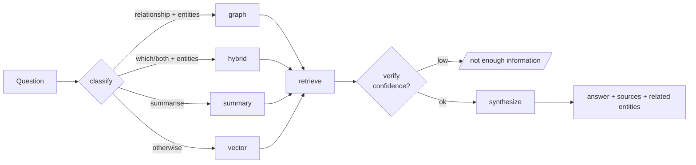
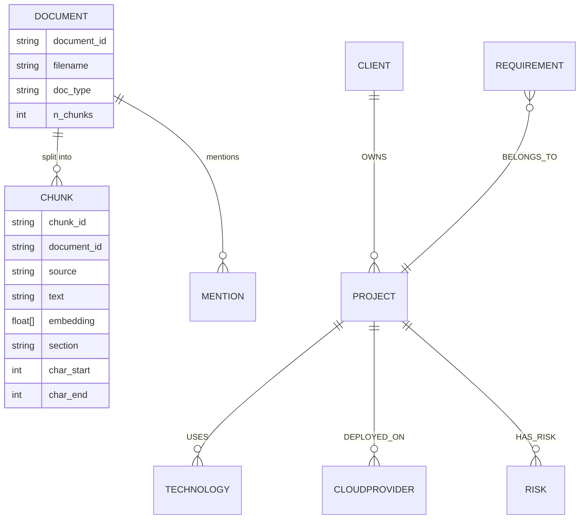

# System Design — MedNova Agentic AI Knowledge Platform

This document explains the architecture, the design decisions and their trade-offs, the data
model, and the scalability/cloud path. A rendered PDF version with the same content and
higher-resolution diagrams is in
[`MedNova_Architecture_and_System_Design.pdf`](MedNova_Architecture_and_System_Design.pdf).

## 1. Design goals (the "why")
1. **Grounded & honest** — every answer cites sources; the system says when it doesn't know.
2. **Runs anywhere in minutes** — zero mandatory keys or cloud accounts.
3. **Swap-by-config to production** — every external dependency sits behind an interface, so
   OpenAI, Neo4j, Astra DB, Redis and Langfuse replace the local defaults without code changes.
4. **Relationships are first-class** — a knowledge graph handles connection questions that
   vector search alone answers poorly.

These goals drove the single most important decision: **offline-first defaults with
interface-bound upgrades**. A reviewer gets a working system immediately; a production team
gets a clean migration path.

## 2. Architecture

```mermaid
flowchart TB
    subgraph Clients
        U[Employee / Web client<br/>Swagger, curl, Postman]
        V[Voice client<br/>transcript / audio]
    end
    subgraph API[FastAPI Backend]
        A[API layer<br/>/health /ingest /ask /voice/ask<br/>validation + error handling]
        R[Agentic Router<br/>classify → plan → retrieve → synthesize → verify]
        RAG[RAG pipeline<br/>vector + rerank]
        GR[GraphRAG pipeline<br/>entity match + neighbourhood]
        SUM[Summarise route]
        L[LLM provider layer<br/>LiteLLM + extractive fallback]
        ING[Ingestion worker<br/>load→chunk→embed→extract]
        C[Cache<br/>Redis | in-memory LRU]
        Q[Queue<br/>BackgroundTasks | Celery-ready]
        O[Observability<br/>logs, latency, Langfuse]
    end
    subgraph Data[Data & Model Layer]
        VDB[(Vector store<br/>NumPy · Astra-ready)]
        GDB[(Graph store<br/>NetworkX · Neo4j-ready)]
        EMB[Embedding model<br/>sentence-transformers / hash]
        LLM[LLM provider<br/>OpenAI/Ollama · optional]
        RED[(Redis · optional)]
    end
    U --> A
    V -->|STT| A
    A -->|/ask| R
    A -->|/ingest async| ING
    A -.lookup.-> C
    R --> RAG & GR & SUM
    RAG --> VDB & EMB
    GR --> GDB
    RAG & GR & SUM --> L
    L -.if key.-> LLM
    ING --> EMB & VDB & GDB
    C -.-> RED
    Q -.-> RED
    R -.-> O
```

Request path: **validate → cache check → route → retrieve (vector/graph/both) → synthesize →
verify → cache store → respond**. Ingestion runs off the request path as a background job.

## 3. Agentic workflow
The router is an explicit state machine (mapping 1:1 onto a LangGraph `StateGraph`; implemented
without the dependency to stay lightweight):



**Tool-selection logic** is deterministic and explainable (the response includes `route`,
`retrieval_strategy`, `confidence`, `matched_entities` and a short `reasoning`). With an LLM key
the classifier can be upgraded to an LLM call; the interface is unchanged. This is a **practical
choice**: heuristic routing is free, fast, testable and transparent, which matters for an
internal tool that must justify its answers.

## 4. Data model



Two complementary stores, both traceable back to the source document:
- **Vector store** — chunk embeddings for semantic recall (NumPy cosine index today;
  Astra DB / Chroma via the same `add/search/persist/load` interface).
- **Knowledge graph** — typed entities + relationships for reasoning over connections
  (NetworkX today; Neo4j via the same `upsert_node/upsert_edge/neighbors` interface).

Additional records: **cached responses** (`sha256(question) → answer/sources/strategy`, TTL),
and **trace/log records** (`request_id, route, latency_ms, retrieved_chunk_ids, timestamp`).

## 5. Cross-cutting concerns

### Caching (and KV / prompt cache)
- **Response cache** keyed on the normalised question hash — a repeat question returns instantly
  and skips the LLM. This is the highest-ROI cache for a "same questions asked repeatedly"
  workload, which is exactly MedNova's stated problem.
- **Embedding cache** avoids re-embedding identical text.
- **Prompt / KV cache**: with a hosted LLM we keep the system prompt and the retrieved-context
  prefix **prefix-stable**, so provider-side prompt caching (and server-side KV cache reuse)
  cut token cost and latency on similar requests. Backend is Redis in production, in-memory
  locally — one interface.

### Queues / background processing
Ingestion is compute- and I/O-heavy, so it must not block the API. `/ingest?async=true` enqueues
a job (FastAPI BackgroundTasks + in-process `JobStore`) and returns a `job_id`; `/jobs/{id}`
reports status. The `run_ingestion_job` boundary is written to become a Celery task unchanged,
with Redis/RabbitMQ as the broker and N workers for horizontal ingestion throughput.

### Observability & reliability
Structured JSON logs (one line per event) with `request_id`, `route`, `latency_ms`, retrieved
chunk ids, cache hit/miss and (with a hosted LLM) token usage. `trace_event` spans wrap the
retrieve and synthesize steps and emit Langfuse traces when configured. HTTP responses carry
`X-Request-ID` and `X-Response-Time-ms`. Errors are caught at the middleware and per-endpoint
level and returned as clean JSON with the request id for correlation.

## 6. Scalability & cloud path
The API is **stateless**, so it scales horizontally behind a load balancer. The migration is
per-layer and independent:

| Layer | Prototype default | Production swap |
|---|---|---|
| Vector store | NumPy cosine index | Astra DB / Chroma server |
| Graph store | NetworkX (JSON) | Neo4j Aura |
| Cache / broker | In-memory TTL-LRU | Managed Redis |
| Ingestion | BackgroundTasks | Celery workers + Redis/RabbitMQ |
| LLM | Extractive fallback | OpenAI / Anthropic / self-hosted via LiteLLM |
| Embeddings | Hashing embedder | sentence-transformers / hosted embeddings |
| Tracing | Structured logs | Langfuse + OpenTelemetry → Prometheus/Grafana |

**LLM routing**: because the provider is abstracted, cheap models can serve classification and
stronger models synthesis — routing by task to balance cost and quality.

## 7. Assumptions
Small, single-tenant corpus of non-sensitive fictional English documents; documents follow light
conventions (a `**Project:**` / `**Client:**` line where relevant) that the extractor exploits
for high-precision relationships.

## 8. Limitations & future work
See the [README](README.md#known-limitations). In short: dictionary-based extraction (bounded
recall), in-process vector index (not sharded), and a less-fluent offline answerer — each with a
documented upgrade. Planned: LLM-based NER + relation extraction, hybrid BM25+vector retrieval
with cross-encoder reranking, streaming, a web UI, full Whisper STT + TTS voice, and RAGAS-style
evaluation in CI.
